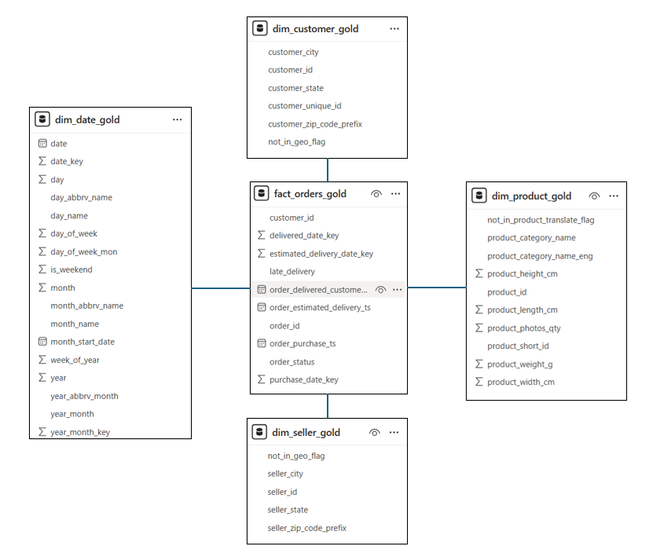
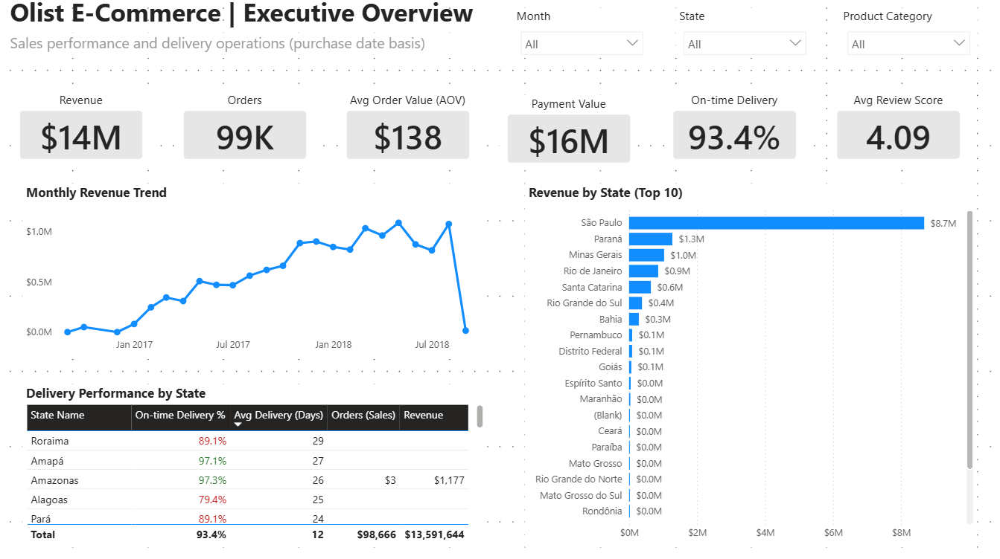

# Olist E-commerce Analytics
### Microsoft Fabric Lakehouse & Power BI

End-to-end analytics solution built on **Microsoft Fabric (Lakehouse + PySpark)** with a **Gold schema optimized for Power BI**.
Focus: **analytics engineering, data modelling, and executive-ready dashboards**.

>Screenshots only. Full notebooks and SQL available upon request.

---

## 🧠 What This Is

A production-style analytics platform built from public **Olist Brazilian E-Commerce dataset**, following a **Medallion Architecture (Bronze --> Silver --> Gold)* and surfaced through a **clean Power BI semantic model**.

Designed to demonstrate:
- Lakehouse-first analytics engineering
- Data quality enforcement before BI
- Schema modeling for fast, stable DAX
- Business-facing dashboards

---

## 🏗️ Architecture

- **Bronze**: Raw ingestion
- **Silver**: Cleansing, normalization, validation
- **Gold**: Analytics-ready facts & dimensions

**Gold Star Schema**
- **Facts**: Orders, Order Items, Payments, Reviews
- **Dimensions**: Date, Customer, Seller, Product, Geography, Payment Type

---

## 🧪 Data Engineering Highlights

- Referential integrity checks between facts & dimensions
- Null and orphan detection (logged, not ignored)
- Type enforcement and standardization in Silver layer
- Power BI-friendly modeling (no bi-directional filters)

---

## 📊 Power BI Dashboards

**Key analysis areas**
- Revenue & orders
- Seller performance
- Payment behavior
- Logistics & delivery performance
- Customer satisfaction

## ⭐ Gold Star Schema (Analytics Layer)

---

## 📐 Metrics & Measures

- Time intelligence (YTD, MoM)
- Weighted delivery duration
- Revenue per order vs per item
- Review score normalization

---

## 🛠️ Tech Stack

Microsoft Fabric · PySpark · Delta Lake · Power BI · Star Schema · DAX

---

## 👤 Author

**FC Ong**
EOF

**Key analysis areas**
- Revenue & orders
- Seller performance
